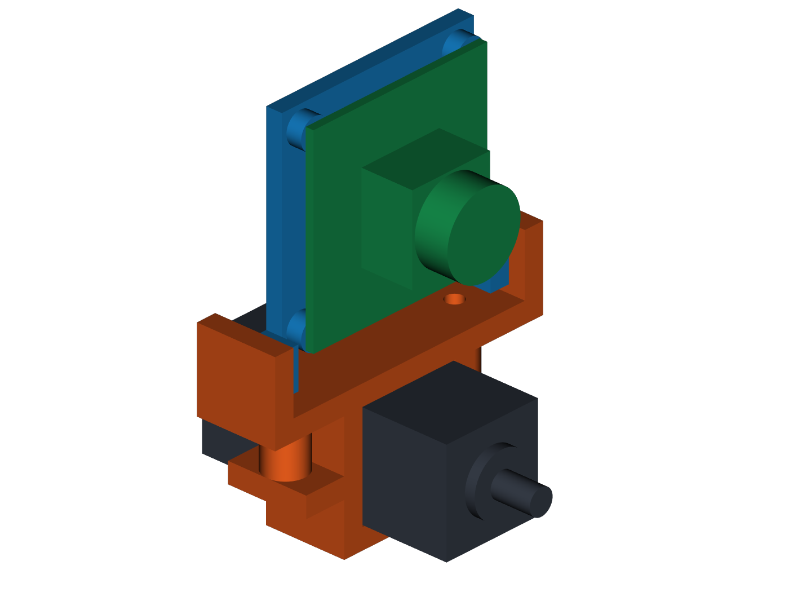

# Dummy 第六轴摄像头支架 V1

这是一套给 DECXIN-3081V1-USB3.0 摄像头使用的三件式可打印支架，夹在
Dummy 最后一节 `20 x 20 mm` 电机的外壳上，不需要拆电机，也不占用电机原有螺孔。



预览颜色：灰色是末端电机参考体，橙色是上下夹块，蓝色是摄像头框，绿色是摄像头参考体。

## 直接打印的文件

- `output/dummy_j6_motor_clamp_bottom.stl`：电机下夹块
- `output/dummy_j6_motor_clamp_top.stl`：电机上夹块和俯仰支座
- `output/decxin_camera_frame.stl`：摄像头框

把这三个 STL 导入 OrcaSlicer、Bambu Studio、Cura 或 PrusaSlicer，即可切片生成
打印机使用的 G-code。`output` 里的 STEP 是可编辑实体；装配 STEP、GLB、`reference`
和 `preview` 文件用于检查，不要当成打印零件。

## 设计尺寸

- 电机方壳：`20 x 20 mm`，夹具内腔 `20.4 x 20.4 mm`
- 夹持长度：`16 mm`
- 摄像头 PCB：`38 x 38 mm`
- 摄像头安装孔距：`34 x 34 mm`
- 摄像头安装孔：V1 暂按 `2.4 mm` 通孔和 M2 螺丝设计
- 中立位置时，摄像头光轴与末端电机轴平行
- 双侧 M3 摩擦转轴可以调整俯仰；CAD 在 `-45°` 到 `+45°` 范围内按每 5°
  一个位置完成了零干涉检查。首次实装建议先限制在约 `±30°`，同时观察 USB 线。

## 五金

- 2 颗 M3 x 20 mm 内六角螺丝和 2 个普通 M3 螺母：锁紧电机夹具
- 2 颗 M3 x 12 mm 内六角螺丝和 2 个 M3 防松螺母：俯仰转轴
- 4 颗 M2 x 10 mm 螺丝、4 个 M2 螺母和绝缘垫片：固定摄像头 PCB
- 可选：夹具内侧贴 `0.2 mm` 橡胶片或布胶带，增加摩擦并保护电机外壳

摄像头螺丝只需拧到 PCB 不晃动，过紧可能压裂电路板。电机夹具两侧交替、逐步拧紧。

## 打印建议

- 材料：优先 PETG；末端电机可能发热，不建议用低耐热的 PLA 做长期件
- 喷嘴：`0.4 mm`
- 层高：`0.2 mm`
- 壁数：4
- 填充：35% gyroid

下夹块的开口分型面朝下。摄像头框的平整背面朝下。上夹块优先用 `16 mm`
端面着床；如果切片软件提示，在两个圆形螺丝柱下方添加支撑。

## 安装顺序

1. 机械臂断电，确认末端电机已冷却。
2. 把上下夹块放到电机方壳暴露区域，避开电机接缝、原有螺丝和导线。
3. M3 x 20 螺丝从上方穿入，螺母放入下夹块底面的六角槽，交替拧紧。
4. 把蓝色摄像头框放在两侧转轴支座之间，用 M3 x 12 和防松螺母连接。
5. 镜头朝夹爪方向，把 PCB 放在四个圆柱支点上，用 M2 螺丝和绝缘垫片固定。
6. Type-C 线从框架下部开口引出，留出活动余量，并在电机固定侧做应力释放。
7. 先用手或最低速度走完整个腕部运动范围，确认支架、镜头和 USB 线都不碰撞。

## 仍需实物核对

厂家图标出了 `34 x 34 mm` 孔距，但没有标注安装孔直径，所以当前采用 M2 是一项
明确假设。Dummy STEP 给出了末端电机方壳尺寸，但不包含你实际安装的夹爪和线缆。
建议先用普通质量打印 V1 试套；不要在确认间隙之前让机械臂高速运行。

## 重新生成和验证

尺寸集中在 `build_camera_mount.py` 顶部的 `Parameters` 中。首次使用先创建虚拟环境，
然后进入本目录运行：

```powershell
python -m venv .venv
& '.\.venv\Scripts\python.exe' -m pip install -r requirements.txt
& '.\.venv\Scripts\python.exe' '.\build_camera_mount.py'
& '.\.venv\Scripts\python.exe' '.\tools\verify_mount.py'
```

验证报告保存在 `output/verification.json`。验证内容包括 STL 闭合性、非流形边、STEP
重新导入，以及俯仰范围的实体干涉扫描。
